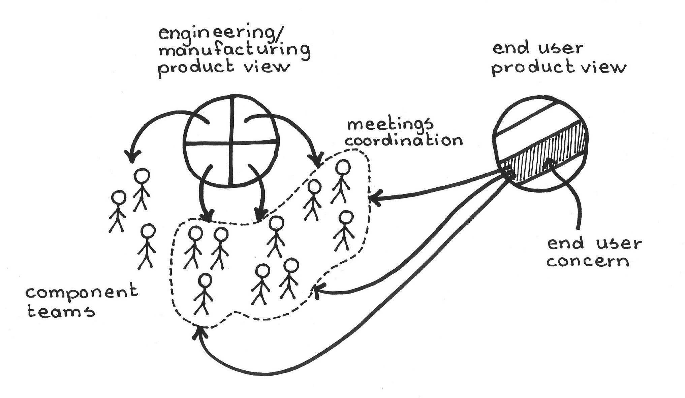
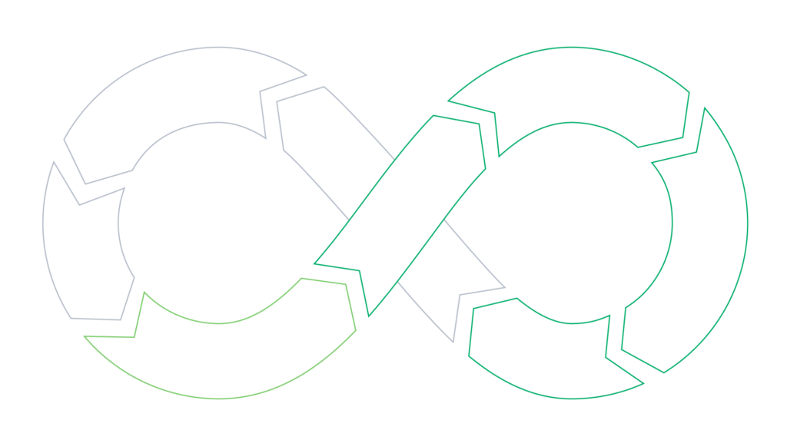
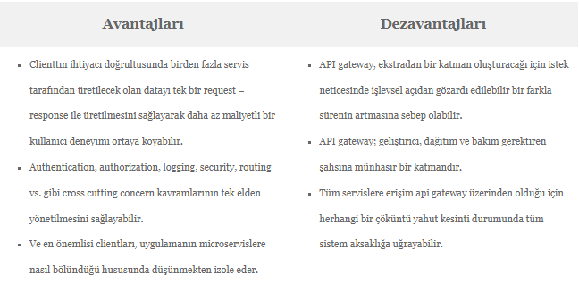
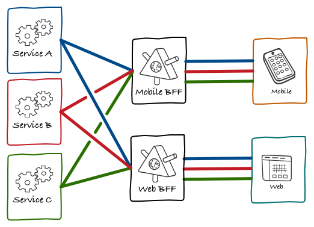
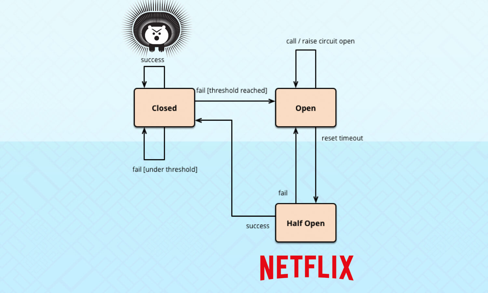
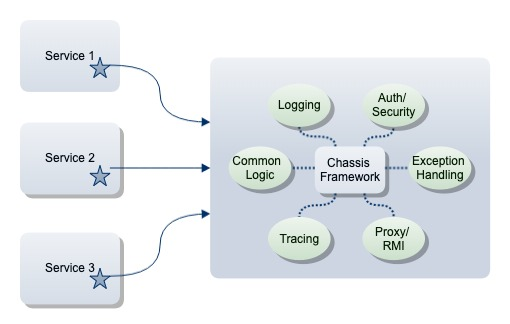

# 1. Conway’in Kanunu’ nu (Conway’s Law) açıklayınız.

*Yaklaşım basitçe bir yazılımın geliştirilme sürecinde çok sayıdaki farklı modülün farklı kişiler tarafından geliştirilmesi süresinde yaşanan iletişimin yazılıma da yansımasından bahsetmektedir. Örneğin bir yazılımın ara-yüzünü tasarlayan ve arkadaki kodları yazan iki farklı kişi olduğunu düşünelim, yazılımın tamamlanması için bu iki kişinin birbiri ile iletişim halinde olması gerekecektir. Ara-yüzde görülen her özellik aslında bu iletişimin bir sonucu olacak ve yazılımın başarısı, işlevselliği kullanılabilirliği gibi çok sayıdaki özellik de bu iletişime bağlı olacaktır.*

# 2. Software as a Service (SaaS), Platform as a Service (PaaS), Infrastructure as a Service (IaaS), On-Premises kavramlarını örneklerle açıklayınız.

* SaaS

    * *SaaS kısaca; müşteriler tarafından ulaşılmak istenen verilere internet bağlantısı ve web tarayıcısı olan herhangi bir cihazdan erişilmesini sağlayan bulut tabanlı bir yazılım sağlama servisidir. Bu servis ile yazılımı sağlayıcısı, sunucu ve veritabanı gibi sistemleri barındırmak ve bunların bakımını yapmakla sorumludur.*

* PaaS

    * *Platform as a Service (PaaS) yani Hizmet Olarak Platform, üçüncü taraf bir bulut hizmet sağlayıcısının, genellikle uygulama barındırma veya geliştirme için gerekli olan bazı donanım ve yazılım araçlarını, müşterilere internet üzerinden sunduğu bir bulut hizmeti sunumu modelidir. Bu platform; bilgi işlem, bellek, depolama, veri tabanı ve diğer uygulama geliştirme hizmetlerini içerir. PaaS çözümleri, dahili kullanım için yazılım geliştirmek için kullanılabilir veya satışa sunulabilir.*

* IaaS

    * *IaaS modelinde sağlayıcınız; sunucular, depolama, ağ donanımı ve sanallaştırma (hipervizör) katmanı dahil olmak üzere uygulama ve hizmetler sunmak için ihtiyaç duyduğunuz tüm fiziksel ve sanal çekirdek altyapıyı sağlar ve barındırır. Bileşenler çalışmaya başladığında DevOps görevi devralır ve gerekli tüm ara katman yazılımlarını, uygulama yazılımlarını, veri tabanlarını vb. yükler ve bakımını yapar. Sağlayıcınıza kullandığınız kaynaklar için abonelik temelinde ödeme yapar ve tüketiminizi ölçeklendirebilirsiniz.*

* On-Premises

    * *Şirket içi yazılım, sunucu grubu veya bulut gibi uzak bir tesiste değil, yazılımı kullanan kişi veya kuruluşun tesislerinde bulunan bilgisayarlara kurulur ve çalıştırılır. Şirket içi yazılıma bazen "shrinkwrap" yazılımı denir ve şirket dışı yazılıma genellikle "hizmet olarak yazılım" veya "bulut bilişim" denir.*

# 3. Continuous Integration, Continuous Delivery ve Continuous Deployment kavramlarını açıklayınız.

* Continuous Integration

    * *Sürekli entegrasyon, kod üzerinde yapılan her değişikliğin ardından, tüm sistemin çalışır durumda olduğunu, yapılan değişikliğin sistemin bazı bölümlerinde kırılmalara yol açmadığını tespit etmek için kullanılan yöntemdir. Kırılmaları tespit edebilmek için birim testlere ihtiyaç duyulmaktadır. Bu testler, yapılan değişikliğin neticesi olarak yeni bir yapı (build) hazırlandıktan sonra otomatik olarak çalıştırılır.*

* Continuous Delivery & Continous Deployment

    * Sürekli Teslimat Sürekli Entegrasyonun doğal bir uzantısıdır. Sürekli Teslimat, başarılı olan bir yapıyı (build) bir ortama atmanın otomatik bir yoludur. Burada teslimat ile dağıtım arasında küçük bir nüans vardır. Teslimat manual olarak, dağıtım ise otomatik olarak yapılmasıdır. Sürekli teslimat düzgün bir şekilde uygulandığında, müşteriler her zaman standartlaştırılmış bir test sürecinden geçmiş hazır yapıya sahip olacaklardır. Netflix, tamamen otomatik bir sürekli dağıtım sistemine sahip olduğu için bilinir. Dağıtımlar otomatik olduğundan ve herhangi bir zamanda gerçekleşebileceğinden, uygulamanız, yeni bir sürüm dağıtıldığında geçici kesintilerden etkilenmeyecek şekilde tasarlanmalıdır.

# 4. API Gateway pattern’ı açıklayınız.

*Son yıllarda duymaya alıştığımız internet of things(nesnelerin interneti) olayının artması üzerine, kullanılan API’ların yönetiminden doğan zorluklara karşı Amazon Web Service tarafından getirilen çözümdür.*

*Özellikle microservice yapılanmalarında kullanılan kompleks servislerin clientlara karşı tek elden açılmasını sağlayan ve böylece bir cephe niteliğinde olan bir API’dır. Clientlar bu API üzerinden güvenlik ve yetkilendirme kontrollerinden geçerler ve hedefteki microservice’i API Gateway aracılığıyla tetikleyerek sonuç alırlar.*

*API Gateway, client ile sıkı bağlı(tightly coupled) bir bağ yarattığı için eleştirilir ancak avantajları bu dezavantajı ciddi manada gölgelemekte olduğundan bu durum göz ardı edilebilmektedir.*

> API Gateway’in temel işlevi clienttan isteği alıp uygun servise iletmesidir.

# 5. Backend for frontend (BFF) pattern’ ı açıklayınız.

*Her client için ayrı bir api-gateway tanımlanmasını konu alır. Yani yukarıdaki 3 durum için (web-ui,mobile-app,3rd app) 3 farklı BFF ile sorunlarımızı çözümlemeye çalışan pattern’e denir.*

* BFF’in avantajlarından bahsetmek gerekirse;
    * Her client için uygun api’yi sağlar.
    * Olası problemlerin yönetimini kolaylaştırır.
    * Her client için mikroservisleri bölümlere ayırır.
    * Business logic’i mikroservislerden alarak tek bir nokta üzerine almamızı sağlar.

* BFF’in dezavantajlarından bahsetmek gerekirse;
    * Uygulama sayısının artmasıyla birlikte bakım ve operasyon maliyetlerinin artması
    * Mimari karmaşıklığın artması
    * Eklenecek ayrı bir katmanın ağ isteklerinde gecikme yaratma ihtimali
    * BFF’lerde kod tekrarlarının yapılma ihtimali

 

   

# 6. Circuit-breaker pattern’ ı açıklayınız.

*Bir örnek ile anlatacak olursak, sistemimize Microservice mimarisini uyguladık ve ardışık olarak birbirini request gönderen bir dizi servisimiz mevcut. Diğer bütün servisler gibi bu dizideki servislerin de down olma ihtimali var ve eğer herhangi biri requestlere cevap veremezse bu bütün akışı aksatıp bir dizi ardışık hataya sebep olabilir. Eğer bu cevap dönemeyen requesti yapan çok fazla caller olursa bu da kaynak tüketimi kritik düzeyde arttırıp bir çok servisi ve butun sistemi etkileyecek bir dizi ciddi soruna yol acabilir. Circuit breaker bu gibi durumlarda bir devre anahtarı gibi davranarak belli bir thresholdun(eşik değeri) üstünde hata alındığında, response dönemeyen servise gelen requestleri servise iletmeden(open_state), requestlere bir hata mesajı veya bilgi verici mesajla dönüş yaparak sistemin gereksiz yere aşırı yüklenmesini engeller. Belli bir timeouttan sonra gelen requestlerin bir kısmını servise ileterek test yapıp sistem durumunu kontrol eder(half_open state).Eğer sıkıntı giderilmiş ise bütün isteklerin geçmesine izin verir (closed state) ve sistem düzeni korunmuş olur, eğer test çağrıları da hata mesajı alıyorsa, yine requestlere error donup bu döngüyü devam ettirir.*

 

   

# 7. Microservice chassis pattern’ ı kısaca açıklayınız.

 *Yeniden kullanılabilirlik, geliştirici hayatımızın en başında öğrendiğimiz bir şeydir. Bu model, ortak mantığı ayrı bir katmana soyutlayarak hizmetler arasındaki artıklık faktörünü ve karmaşıklığı azaltır. Çok genel bir chassis'iniz varsa, platformlar veya kuruluşlar arasında bile kullanılabilir ve belirli bir projeyle sınırlandırılması gerekmez. Nasıl yazdığınıza ve bu çerçeveye hangi mantıkla hareket ettiğinize bağlıdır.*

 *Chassis pattern, mikro hizmetler altyapı katmanınızın bir parçasıdır. Her türlü bağlantıyı, yapılandırmayı ve izlemeyi bir temel çerçeveye taşıyabilirsiniz.*

  

   
